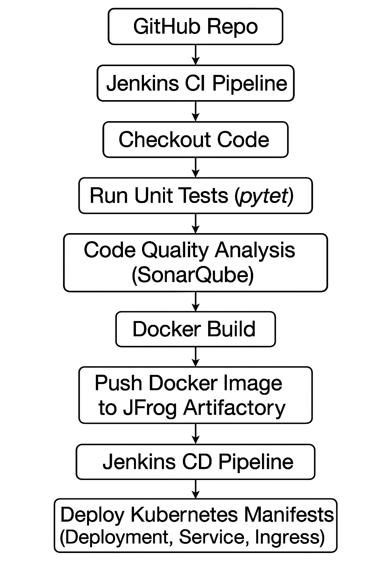

## Hello World Python App - CI/CD Pipeline

This project demonstrates a complete CI/CD pipeline to build, test, and deploy a Python Flask application using Jenkins, SonarQube, Docker, and Kubernetes.

### Project Structure

```
python-cicd-pipeline-docker-kubernetes/
- app/
- docker/
- jenkins/
- k8s/
- docs/
- tests/
```

### Workflow

1. **CI Pipeline (Jenkins)**
    - Clone the GitHub repository
    - Perform unit tests using `pytest`
    - Perform code quality analysis using SonarQube
    - Build a Docker image of the Python app
    - Push the Docker image to JFrog Artifactory

2. **CD Pipeline (Jenkins)**
    - Pull the latest Docker image
    - Deploy the application to a Kubernetes cluster using deployment, service, and ingress manifests

### Tech Stack

- **Python 3.11**
- **Flask** (web framework)
- **Jenkins** (CI/CD)
- **SonarQube** (code analysis)
- **Docker** (containerization)
- **Kubernetes** (deployment)
- **JFrog Artifactory** (Docker image repository)

### Prerequisites

- A running Kubernetes cluster
- Jenkins server configured with:
  - Docker
  - SonarQube integration
  - Kubeconfig credentials to deploy to Kubernetes
- Access to JFrog Artifactory

### Deployment Diagram



### Access Application

After deployment, the application can be accessed at:

```plaintext
http://hello-world.yourdomain.com
```

Ensure DNS is configured to route traffic to the Kubernetes ingress controller.

### How to Run Locally

```bash
cd app/
pip install -r requirements.txt
python app.py
```

The app will be available at `http://localhost:5000`
